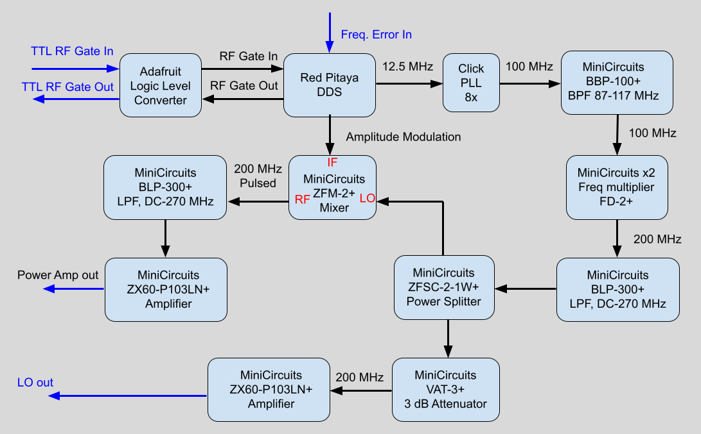
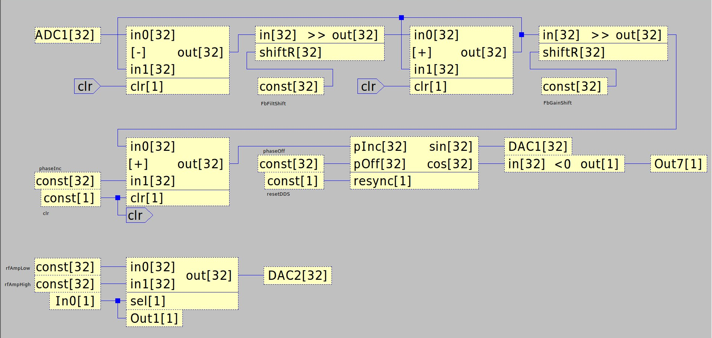
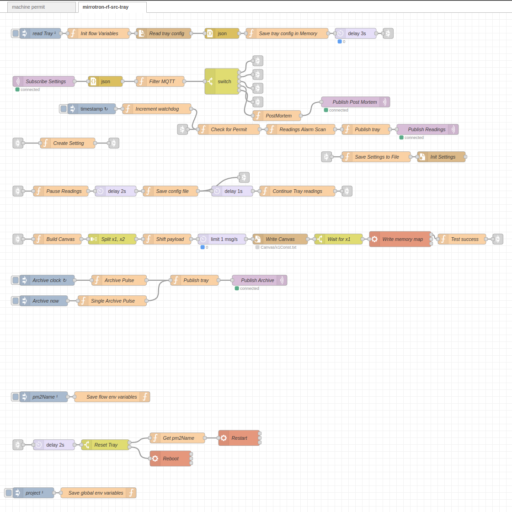
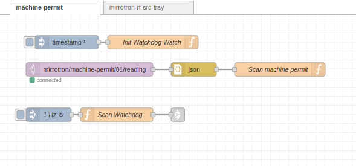

# RF Frequency Source
* mirrotron-rf-src-tray <a href="https://github.com/bl-mirrotron/mirrotron-rf-src-tray" target="_blank">source code</a>
* [RF source overview](https://bl-mirrotron.github.io/#rf-source)

The function of the RF frequency source is to provide pulsed 200 MHz RF with frequency and amplitude control. In addition it provides a local oscillator signal to the Phase Detector module and in return receives a frequency error signal from the Phase detector. The block diagram of the frequency source is shown in [Figure 1](#figure-1). The RF signal is generated by a Direct Digital Synthesizer (DDS) implemented by the [Red Pitaya Stemlab 125-14](https://redpitaya.com/stemlab-125-14/) FPGA. The FPGA was programmed with the [CANVAS](https://content.redpitaya.com/blog/canvas-a-free-graphical-dsp-design-tool-for-red-pitayas-fpga) tool that is a graphical system for implementing digital signal processing functions into the Stemlab 125-14 FPGA. The CANVAS circuit is shown in [Figure 2](#figure-2).

The clock of the Stemlab 125-14 is 125MHz so a 200 MHz signal cannot be generated directly. Instead a 12.5 MHz signal is generated by the DDS and then this signal is multiplied up to 100 MHz with 8x phase lock loop withe the <a href="https://github.com/bl-mirrotron/mirrotron-rfq-llrf-timer-cube" target="_blank">RFQ LLRF Timer Cube circuit</a>. The signal is then frequency doubled to 200 MHz. The phase increment on the DDS is set by a 32 bit word so the final frequency resolution is less than 0.5 Hz out of 200MHz.

The tray code uses the Blinky-lite Canvas interface in which all settings are mapped to a GPIO memory address on the Red Pitaya. The tray code is shown in [Figure 3](#figure-3).

The RF Frequency source is the main actuator for the [Machine Permit system](https://bl-mirrotron.github.io/#machine-protection-system). When the Machine Permit system detects a fault, the tray code shown in [Figure 4](#figure-4) resets the Direct Digtal Synthesizer which disables any RF output from the RF Frequency source.

##### Figure 1 #####
*RF Frequency Source Block Diagram* 

##### Figure 2 #####
*RF Frequency Source DSP Code* 

##### Figure 3 #####
*RF Frequency Source Tray Code* 

##### Figure 4 #####
*RF Frequency Source Machine Protection Code* 

